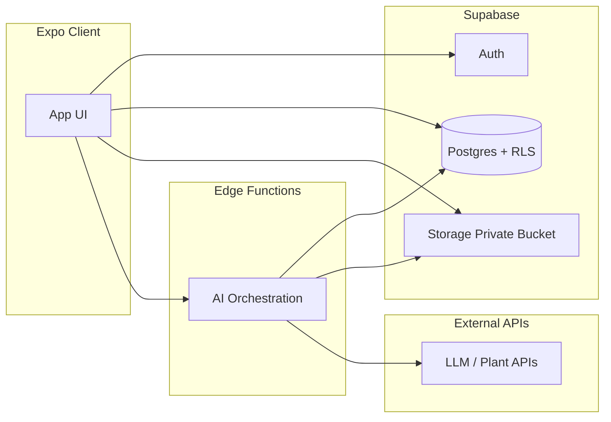

# Data Flow — Plant Care App

**Document status:** Pre-implementation (design-only).

## Legend

- **Solid trust:** Supabase Auth, Postgres with RLS, Storage with policies, Edge Functions (server secrets).  
- **Untrusted:** Expo app; anything labeled `EXPO_PUBLIC_*`.

## High-level flows

### 1. Authentication

```
User → Expo app → Supabase Auth (signUp / signIn / OAuth)
                 ← session (access + refresh JWT) stored in secure client storage
```

- Client receives **user JWT** only.  
- **Never** receives `service_role`.  
- `EXPO_PUBLIC_SUPABASE_URL` and `EXPO_PUBLIC_SUPABASE_ANON_KEY` are embedded in the app (public).

### 2. Plant CRUD and care logs

```
User → Expo (authenticated) → Supabase PostgREST → Postgres
                                  ↑
                            JWT validated; RLS enforces auth.uid() = user_id
```

- All inserts/updates include `user_id` matching the authenticated user (or derived server-side via triggers — see schema doc).  
- No direct client access to other users’ rows.

### 3. Photo upload (private bucket)

```
User → Expo picks image → Client requests upload permission (Supabase Storage API with user JWT)
                        → Upload to path: {user_id}/{plant_id}/{photo_id}
                        → Metadata row in plant_photos (same user_id, RLS)
```

- Bucket is **private**.  
- Client does not construct paths with display names or plant nicknames.  
- **Server-side AI** reads images via `service_role` inside Edge Functions only when needed for analysis (not via leaked URLs in logs).

### 4. AI condition analysis (server-side only)

```
User → Expo → Edge Function (Authorization: Bearer <user JWT>)
           → Function verifies JWT / user id
           → Function loads minimal plant + log summary + storage path refs (not necessarily raw image in prompt if using vision API with separate image fetch)
           → Function calls OpenAI / Anthropic / Plant.id / Kindwise with SERVER secrets
           → Function writes diagnosis row (user_id, tentative language) OR returns redacted summary
           ← Expo displays possibilities + disclaimer
```

- **API keys** never leave the Edge runtime environment.  
- Client **never** calls OpenAI/Anthropic/Plant.id directly.

### 5. Today’s recommended care actions

```
User → Expo → Edge Function (or Postgres RPC secured by RLS + deterministic rules)
           → If AI-assisted: same as flow 4 with minimized context
           ← Structured actions (e.g., water, check leaves) with non-definitive wording if model-generated
```

- Prefer **caching** and **idempotent** writes for recommendations if stored per day.

## Data minimization for AI

| Data | Send to model? | Notes |
|------|----------------|-------|
| user email, phone | No | Not needed for plant care |
| Exact GPS / address | No | Strip EXIF if present |
| Plant display name | Avoid if possible | Use internal plant_id + species label if needed |
| Care log types/dates | Yes (aggregated/summarized) | Reduces tokens |
| Image | Only if required | Downscale server-side; no logging of image bytes |

## Cross-boundary checklist

- [ ] No AI provider key in Expo env or source.  
- [ ] No `service_role` in client.  
- [ ] All Postgres user tables: `user_id` + RLS.  
- [ ] Storage: private bucket + path convention + policies.  
- [ ] Edge Functions: validate JWT before any user-scoped read/write.  

## Diagram (Mermaid)


